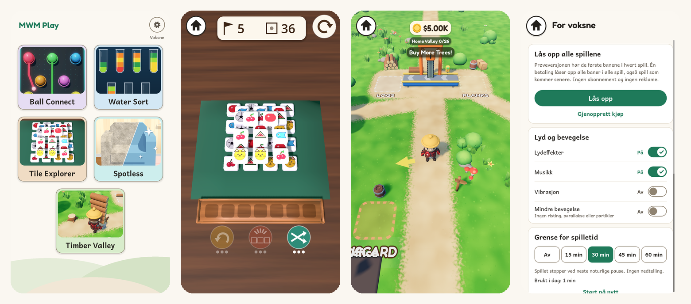

# MWM Play

One Android app with calm puzzle and play games for children and families. No ads, no tracking, no data collected, works offline. Planned exception: chess will get optional play between two phones (same Wi-Fi or online, end-to-end encrypted, behind the parent gate), which gives the whole app the internet permission; see [docs/INTERNET.md](docs/INTERNET.md) for why and what uses it. Children can try every game for free; a parent can unlock everything with one payment behind a parent gate.

Website and privacy policy: https://play.mwmai.no

**Getting around:** the round house button in the top-left corner leads back to the start screen from every game, the parent gate and the parent area ("For voksne"). Inside a game it needs two taps within 2 seconds, so a child does not leave by accident. On the adult sub-pages (privacy, licences, play-together tips) the same corner holds a back arrow that goes up to "For voksne". Android's back gesture works too.

## Download

Latest test build (debug APK, Android 7.0+, arm64 and 32-bit ARM, about 195 MB):
**https://github.com/Matswm86/mwm-play/releases/download/latest/mwm-play.apk**

Open the link on the phone, then allow "Install unknown apps" for the browser when Android asks. The link always points to the newest build from `main`.

## Games inside

- Ball Connect
- Water Sort
- Tile Explorer
- Spotless
- Timber Valley

More games join one at a time as they pass the child-safety checks in `docs/CHILD_UX_RESEARCH.md`.

## Layout

- `app/`: the Godot 4.6 project (portrait 1080x1920, Mobile renderer). The shell lives in `app/shell/`, each game in `app/games/<slug>/`.
- `tools/sync_game.py`: copies a game in from its own repo at a given commit and records the commit in `app/games/<slug>/SOURCE`. `tools/check_collisions.py` reports an error if two games share a class name, autoload, `user://` file name or resource id; `sync_game.py` runs it after every copy.
- `docs/`: design spec, child UX research (46 rules with sources), merge plan, internet-permission note, QA report, mockups.
- `site/`: the static page served at play.mwmai.no.

## Build

GitHub Actions builds a debug APK on every push (`.github/workflows/build-android.yml`). Nothing is built locally.

## Status

Version 0.1.0, early test build. The unlock button shows "Kommer snart" until Google Play Billing is wired in.
